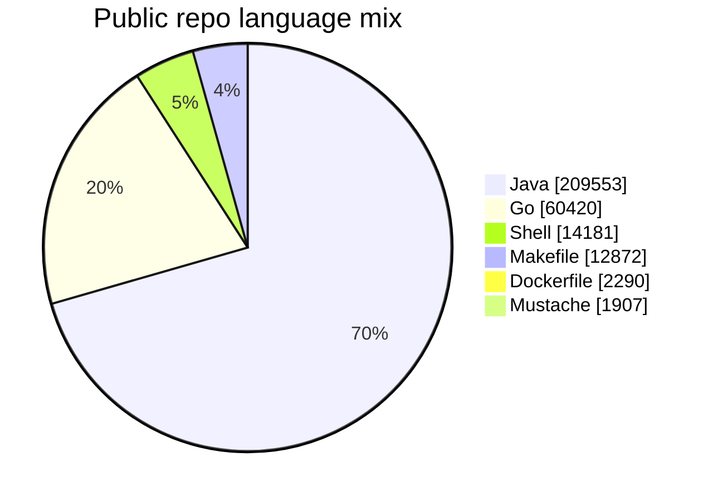

# Hey there, this is Sai

I build practical AI workflows for the messy parts of engineering: repeated checks, context switching, release steps, documentation drift, and operational tasks that quietly eat time.

My work sits at the intersection of SRE, DevOps, cloud-native platforms, and applied AI. I like turning complex systems into simpler paths with agents, automations, pipelines, and guardrails that help teams move faster with more confidence.

  
  
  
  
  
  

## Main Skills

  <strong>Languages</strong> 
  
  
  
  
  
  
  
  

  <strong>Frameworks and runtimes</strong> 
  
  
  
  
  
  
  
  

  <strong>AI tools</strong> 
  
  
  
  
  
  

## What I'm Working On

### AI workflows and agents

I like building practical AI systems that reduce manual effort, connect knowledge across tools, and make day-to-day engineering work smoother.

- AI-assisted operational workflows for SRE, DevOps, documentation, and release tasks.
- Agentic tooling that helps teams reason over infrastructure, CI/CD, incidents, and engineering knowledge.
- Automation that turns natural language intent into reliable, repeatable actions.

### Research and patents

My research interests include AI-powered workflows, context-aware automation, media intelligence, and self-healing engineering systems.

- Inventor on [US 12,482,498](https://patentsgazette.uspto.gov/week47/OG/html/1540-4/US12482498-20251125.html) and [US 12,482,499](https://patentsgazette.uspto.gov/week47/OG/html/1540-4/US12482499-20251125.html), both titled **System and method for AI-powered narrative analysis of video content**.
- Co-author of [Adaptive Natural Language Processing-Based Test Automation Framework: Enabling Self-Healing and Context-Aware Test Cases](https://doi.org/10.5121/ijci.2026.150104).
- Co-author of [Semantic Intelligence in Test Automation: Context-Driven Adaptation Through Natural Language Understanding and Machine Learning](https://doi.org/10.5121/ijsea.2026.17202).

### Cloud-native automation

I like building small, practical tools that remove toil from infrastructure and release workflows.

- [snapscheduler](https://github.com/saipadmam/snapscheduler): scheduled snapshots for Kubernetes persistent volumes, written in Go.
- Kubernetes operations: controllers, platform workflows, deployment automation, and reliability improvements.

### Platform engineering and reliability

I work on the systems behind software delivery: CI/CD pipelines, GitHub workflows, infrastructure repositories, and operational guardrails.

- Delivery automation that makes deployments more repeatable and easier to reason about.
- Infrastructure patterns that support scale, consistency, and safer day-to-day operations.

### Cloud and developer tooling

I enjoy connecting cloud platforms with developer workflows so teams can spend more time shipping and less time fighting setup.

- [gcp-plugin-core-java](https://github.com/saipadmam/gcp-plugin-core-java): Java libraries for integrating Google Cloud Platform with open source tools.
- GitHub, Jenkins, Argo CD, Kubernetes, Terraform, and observability-focused workflows.

## Toolbox

**Cloud and infrastructure:** Kubernetes, Google Cloud Platform, Terraform, Helm, Argo CD  
**AI and automation:** AI workflows, agentic tooling, NLP, self-healing automation, MCP  
**Automation and delivery:** GitHub Actions, Jenkins, CI/CD, GitOps, release engineering  
**Languages:** Go, Java, Python, Bash  
**Focus areas:** reliability, platform tooling, developer experience, observability, operational excellence

## How I Work

- I like AI that solves real workflow problems instead of just looking impressive in a demo.
- I prefer automation that is easy to understand, easy to operate, and boring in production.
- I care about clean handoffs between infrastructure, application teams, and release workflows.
- I like documentation that helps the next engineer finish the job without needing a meeting.

## GitHub Snapshot

<!-- GITHUB_SNAPSHOT:START -->
<!-- Auto-updated by .github/workflows/update-profile-snapshot.yml. -->

**Snapshot**

- Public repositories analyzed: **4**
- Total public stars: **0**
- Top languages: **Java, Go, Shell, Makefile**
- Refresh cadence: **hourly when data changes**

<!-- GITHUB_SNAPSHOT:END -->

## Connect

The best way to see what I'm building is through my repositories: [github.com/saipadmam](https://github.com/saipadmam).
