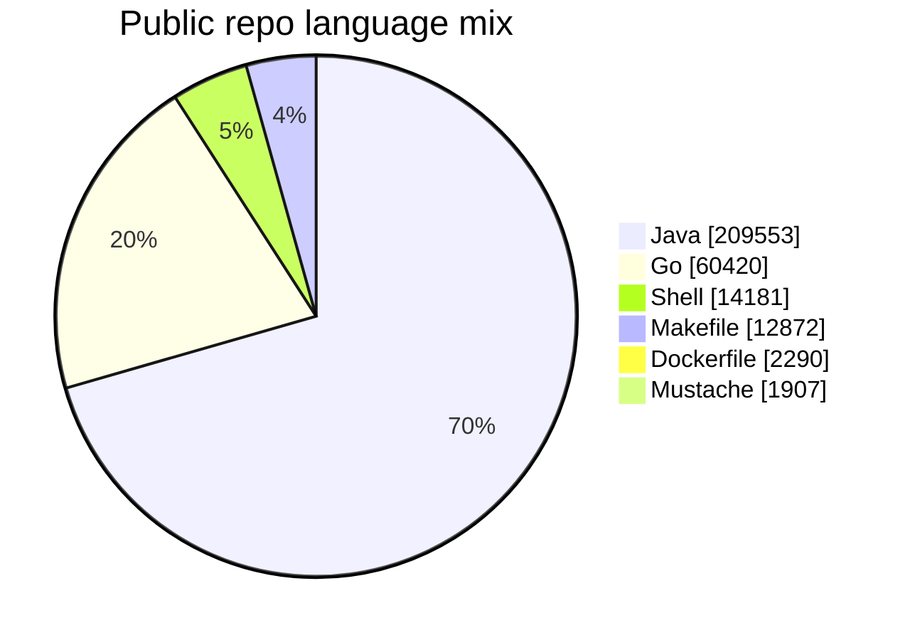

<h1>Hey there, this is Sai</h1>

<strong>AI workflow builder. Platform engineer. Practical automation enthusiast.</strong>

I build calm, useful systems for the messy parts of engineering: repeated checks, context switching, release steps, documentation drift, and operational work that quietly eats time.

## About

My work sits at the intersection of SRE, DevOps, cloud-native platforms, and applied AI. I like turning complex systems into simpler paths with agents, automations, pipelines, and guardrails that help teams move faster with more confidence.

The design principle I care about most is clarity: make the useful path visible, remove the unnecessary, and keep the system easy to operate after the demo is over.

## Main Skills

<strong>Languages</strong> 

  

<strong>Frameworks and runtimes</strong> 

  

<strong>AI tools</strong> 

## Current Focus

- Building AI workflows that reduce manual engineering toil and connect knowledge across tools.
- Designing agentic automation for SRE, DevOps, documentation, CI/CD, and release tasks.
- Keeping automation understandable, observable, and practical enough to run in production.

## Research And Patents

My research interests include AI-powered workflows, context-aware automation, media intelligence, and self-healing engineering systems.

- Inventor on [US 12,482,498](https://patentsgazette.uspto.gov/week47/OG/html/1540-4/US12482498-20251125.html) and [US 12,482,499](https://patentsgazette.uspto.gov/week47/OG/html/1540-4/US12482499-20251125.html), both titled **System and method for AI-powered narrative analysis of video content**.
- Co-author of [Adaptive Natural Language Processing-Based Test Automation Framework: Enabling Self-Healing and Context-Aware Test Cases](https://doi.org/10.5121/ijci.2026.150104).
- Co-author of [Semantic Intelligence in Test Automation: Context-Driven Adaptation Through Natural Language Understanding and Machine Learning](https://doi.org/10.5121/ijsea.2026.17202).

## Selected Work

- [snapscheduler](https://github.com/saipadmam/snapscheduler): scheduled snapshots for Kubernetes persistent volumes, written in Go.
- [gcp-plugin-core-java](https://github.com/saipadmam/gcp-plugin-core-java): Java libraries for integrating Google Cloud Platform with open source tools.
- [vibe-ai-powered-content-discovery-system](https://github.com/saipadmam/vibe-ai-powered-content-discovery-system): AI-powered content discovery using NLP and semantic understanding.

## Working Style

- Solve the real workflow problem before polishing the demo.
- Prefer simple, legible automation over clever automation that is hard to operate.
- Write documentation that helps the next engineer finish the job without needing a meeting.

## GitHub Snapshot

<!-- GITHUB_SNAPSHOT:START -->
<!-- Auto-updated by .github/workflows/update-profile-snapshot.yml. -->

**Snapshot**

- Public repositories analyzed: **4**
- Total public stars: **0**
- Top languages: **Java, Go, Shell, Makefile**
- Refresh cadence: **hourly when data changes**

<!-- GITHUB_SNAPSHOT:END -->

## Connect

The best way to see what I'm building is through my repositories: [github.com/saipadmam](https://github.com/saipadmam).
